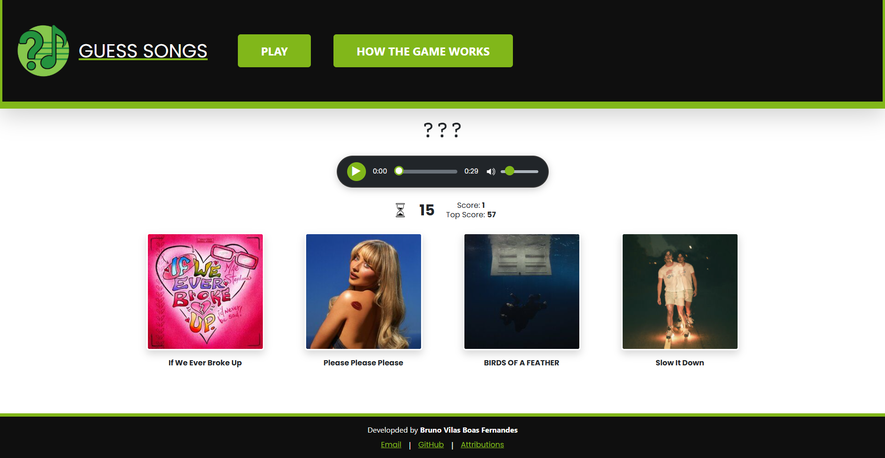
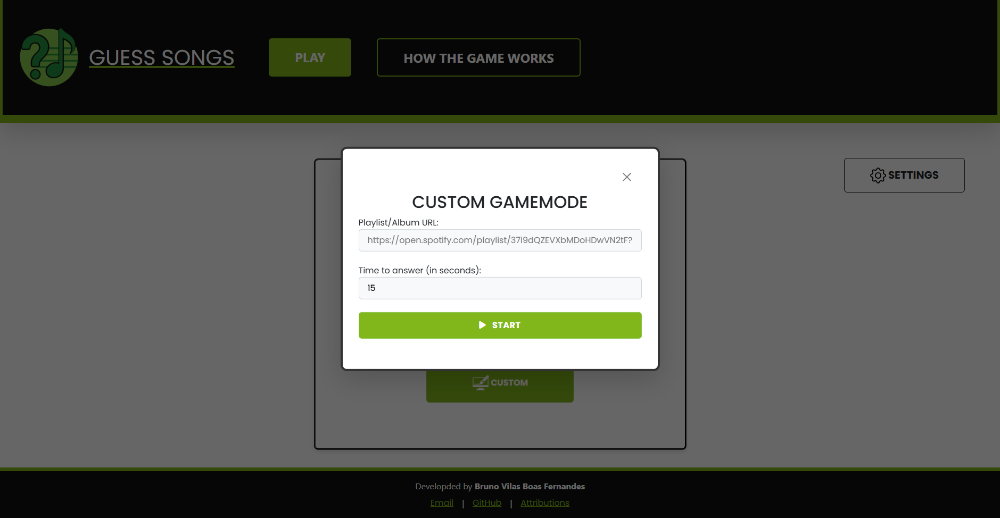
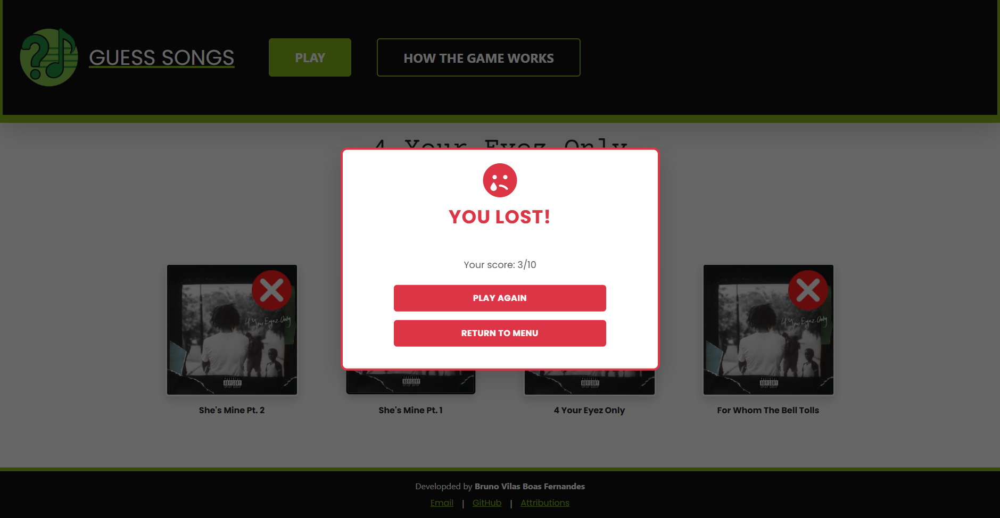

<div align="right">
    <a href="./README.md">🇺🇸 Read in English</a>
</div>

<div align="center">
  
  <h1>Guess Songs!</h1>
</div>

<p align="center">
  Um jogo de quiz musical dinâmico, baseado na web, projetado para testar seus conhecimentos musicais contra o relógio.
  <br />
  <a href="#funcionalidades"><strong>Explore as Funcionalidades »</strong></a>
  <br />
  <br />
  </p>

---

## Sobre o Projeto

Guess Songs é uma aplicação web full-stack que desafia os jogadores a identificar uma música a partir de um pequeno trecho de áudio. Ele possui um backend robusto construído com Python e Flask que busca e processa dados de faixas das principais plataformas de streaming, e um frontend dinâmico e responsivo construído com JavaScript que garante uma jogabilidade fluida e interativa.

O projeto lida com desafios complexos de integração de dados, incluindo um sistema de fallback com "fuzzy matching" para encontrar prévias de áudio e um sistema de cache de múltiplos níveis para alta performance.

<a name="funcionalidades"></a>
### ✨ Funcionalidades

- **Dois Modos de Jogo:**
    - **Singleplayer:** Um modo de jogo rápido com uma playlist padrão selecionada.
    - **Modo Customizado:** Permite que os usuários joguem usando qualquer URL pública de playlist ou álbum do Spotify ou Deezer e definam um tempo customizado por rodada.
- **Busca Inteligente de Previews:** Se uma faixa do Spotify não possui um preview, a aplicação busca de forma inteligente uma versão jogável na API da Deezer usando um sofisticado algoritmo de correspondência aproximada e normalização de texto.
- **Cache de Alta Performance:** Implementa um sistema de cache de múltiplos níveis no lado do servidor para armazenar tokens de acesso do Spotify, buscas individuais na API da Deezer e playlists completas já processadas, reduzindo drasticamente os tempos de carregamento em requisições subsequentes.
- **Player de Áudio Customizado:** Um player de áudio totalmente construído com HTML, CSS e JavaScript para uma interface de usuário única e polida com animações suaves.
- **Design Responsivo:** A interface é totalmente responsiva e otimizada para uma ótima experiência tanto em computadores quanto em dispositivos móveis.

### 🖼️ Telas da Aplicação

<p align="center">
  
  <br>
  <em>A interface principal do jogo durante uma rodada.</em>
</p>
<p align="center">
  
  <br>
  <em>Modo customizado, permitindo que os usuários joguem com suas próprias playlists.</em>
</p>
<p align="center">
  
  <br>
  <em>A tela de fim de jogo mostrando o placar final.</em>
</p>

### 🛠️ Tecnologias Utilizadas

Este projeto foi construído com as seguintes tecnologias:

**Backend:**
- Python & Flask
- Flask-Session (para sessões no lado do servidor)
- Requests (para comunicação com APIs)
- thefuzz & python-Levenshtein (para correspondência de texto aproximada)
- cachetools (para o sistema de cache)
- python-dotenv (para variáveis de ambiente)

**Frontend:**
- HTML5, CSS3, JavaScript (ES6+)
- Bootstrap 5

**APIs:**
- Spotify API
- Deezer API

---

### 🚀 Como Rodar Localmente

Para obter uma cópia local e executá-la, siga estes passos simples.

#### Pré-requisitos

- Python 3.x
- Gerenciador de pacotes `pip`

#### Instalação e Configuração

1.  **Clone o repositório:**
    ```sh
    git clone [https://github.com/Beyonder230/guess-songs.git](https://github.com/Beyonder230/guess-songs.git)
    ```
2.  **Navegue até a pasta do projeto:**
    ```sh
    cd guess-songs
    ```
3.  **Crie e ative um ambiente virtual (recomendado):**
    ```sh
    python -m venv venv
    source venv/bin/activate  # No Windows, use `venv\Scripts\activate`
    ```
4.  **Instale as dependências:**
    ```sh
    pip install -r requirements.txt
    ```
5.  **Configure suas variáveis de ambiente:**
    - Crie um arquivo chamado `.env` na raiz do projeto. Este arquivo guardará suas chaves secretas.
    - Adicione as três variáveis a seguir ao arquivo:

        ```env
        # 1. Chave Secreta do Flask (para segurança da sessão)
        # Para gerar uma chave forte, rode este comando no seu terminal:
        # python -c 'import secrets; print(secrets.token_hex(16))'
        FLASK_SECRET_KEY=sua_chave_secreta_gerada_aqui

        # 2. Credenciais da API do Spotify
        # Obtenha estas credenciais no Painel de Desenvolvedor do Spotify.
        SPOTIFY_CLIENT_ID=seu_client_id_aqui
        SPOTIFY_SECRET_ID=seu_id_secreto_aqui
        ```

    - **Como obter as credenciais do Spotify:**
        1.  Acesse o [Painel de Desenvolvedor do Spotify](https://developer.spotify.com/dashboard).
        2.  Faça login e clique em "Create app".
        3.  Dê um nome (ex: "Guess Songs Clone") e uma descrição para a sua aplicação.
        4.  Uma vez criada, você verá o seu `Client ID` e poderá clicar em "Show client secret" para obter o `Client Secret`. Copie e cole-os no seu arquivo `.env`.

6.  **Execute a aplicação:**
    ```sh
    flask run
    ```
7.  Abra [http://127.0.0.1:5000](http://127.0.0.1:5000) no seu navegador.

---

### 👤 Autor

Desenvolvido com ❤️ por **Bruno Vilas Boas Fernandes**.

- **GitHub:** [https://github.com/Beyonder230](https://github.com/Beyonder230)
